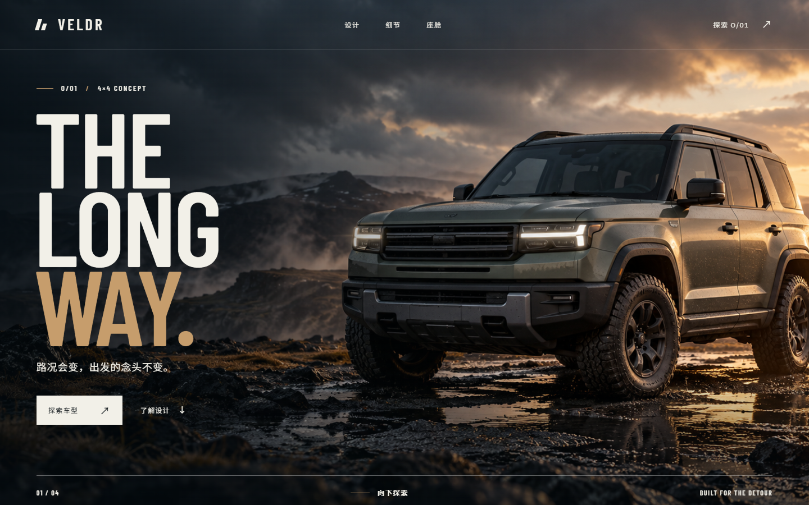
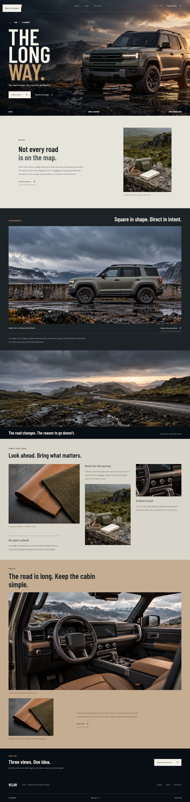

# VELDR O/01

[Live demo](https://pachin1919.github.io/veldr-o01-product-preview/)



A fictional vehicle concept presented through an editorial product site: exterior, cabin, detail views and scroll-linked chapters.

## Pages

- /
- /design
- /cabin
- /explore

## Run locally

```powershell
npm.cmd install
npm.cmd run dev
```

Build the static site with `npm.cmd run build`.

[Deployment](docs/GITHUB-PAGES.md) · [Asset provenance](docs/ASSETS.md) · [Third-party notices](THIRD_PARTY_NOTICES.md)

A visual concept, not a commercial product or service. Original artwork and code are not offered under a general open-source license. Font and dependency licenses are retained separately.


